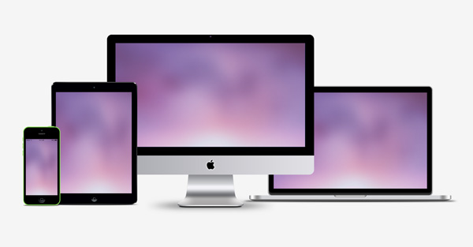
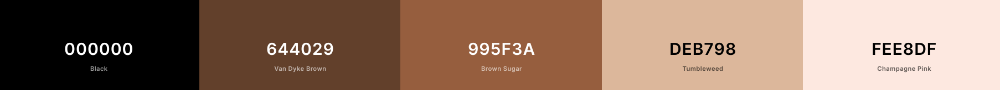
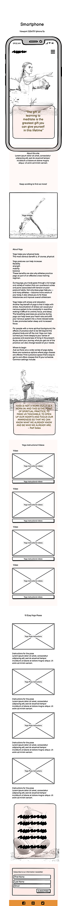
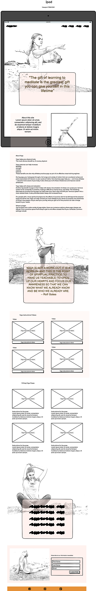

## **Yoga Centric**

## **The goal for this project** 

Welcome to Yoga Centric! 
This is an information site about yoga (whodathoughtit).The goal of the site is to inform the user about the yoga life style and to encourage the user to try out some easy poses. these are to be demonstrated with either still images and some videos.

Thank you for visiting my project!

---

## Table of contents 
- [**Yoga Centric**](#yoga-centric)
- [**The goal for this project**](#the-goal-for-this-project)
- [Table of contents](#table-of-contents)
- [**UX**](#ux)
  - [**The User Goals**](#the-user-goals)
  - [**User Stories**](#user-stories)
  - [**Site owners Goals**](#site-owners-goals)
  - [**User Requirements and Expectations**](#user-requirements-and-expectations)
    - [Requirements](#requirements)
    - [Expectations](#expectations)
  - [**Design Choices**](#design-choices)
    - [Typeface](#typeface)
    - [Colors](#colors)
- [**Wireframes**](#wireframes)
  - [Mobile Wireframe](#mobile-wireframe)
  - [Tablet Wireframe](#tablet-wireframe)

## **UX**

### **The User Goals**

* The website should filled with valuable information for the user
* The website should be easy to use on mobile, tablet and desktop
* The website should be visually appealing
* The website should encourage the user to try yoga
* The website should demonstrate different poses

[Back to Top](#table-of-contents)

### **User Stories**

* As a user, I want to be able to easily find the information on yoga
* As a user, I want to be able to navigate to the each section of the web site
* As a user, 

### **Site owners Goals**
* As the website owner, I want to inform the user about yoga 
* As the website owner, I want to encourage the user to try different some yoga poses
* As the website owner, I want to demonstrate some yoga exercises to the user

[Back to Top](#table-of-contents)

### **User Requirements and Expectations**

#### Requirements
* The site is to be easy to navigate by using the navigation menu
* The site is to be visually appealing
* The site is to encourage users to try poses through poses and videos

#### Expectations
* When clicking on links (like social media), I expect the page to open in a separate browser
* I expect that the navigation links work properly so that is takes me wherever I want to go
* I expect that the video work properly with clear command buttons 

[Back to Top](#table-of-contents)

### **Design Choices**
As the site is to inform the user about yoga, the design choices were made around calmness and tranquility. The site is not to be afraid of blank space.

I have used [ColorSpace](https://mycolor.space/ "Coolors.co") to come up with a color scheme that fits the overall feeling calmness.

#### Typeface
In order to find appropriate typefaces for my website, I have visited [Google Fonts](https://fonts.google.com/ "Google Fonts") to explore the various options.
For the main body text I have chosen the google typeface Source Sans Pro. This is a visually appealing and easy to read typeface.
For the headings I wanted a slightly different typeface. I explored for headings on [Fontpair](https://www.fontpair.co/ "Font Pair") and choose the google font Lato.
This font is visually appealing and pairs well with source sans pro.

#### Colors
I based my color scheme on a pallet devised around beach landscapes using the crams of the sand to help create a calm, natural feeling. 

* rgba(254, 232, 223, 1) This color is called Champagne Pink - will be used as  a background colour and will be used with a .6 transparency. 
* rgba(222, 183, 152, 1) This color is called tumbleweed - to be used as a contrast tot the background colour.
* rgba(153, 95, 58, 1) This color is a called Brown Sugar - This is to be used as my header colours.
* rgba(153, 95, 58, 1) This color is a called Van Dyke Brown - This is to be used as my colour to over lay the Champagne Pink.
* The main colour of my text is to be black.

I have used to contract checker on Coolors in order to make sure that the contract is sufficient.
This way my content will be easily readable. 

[Back to Top](#table-of-contents)

--- 

## **Wireframes**
I have decided to use [Balsamic](https://balsamiq.com/wireframes/) to create wireframes for my website. 
Initially I created a basic wireframe for the mobile and then for tablet with the desktop last. 
For my website I have decided to go for a 1 page scrolling website which suits more with todays current trends, with a fixed navigation bar at the top for easy navigation. 
I based the wireframe on the smaller iphone 5s screen and will apply media queries where required to keep the responsiveness site.

You can find my wireframes below:

### [Mobile Wireframe](wireframes/mobile-wireframe.png)
### [Tablet Wireframe](wireframes/tablet-wireframe.png)
below are reduced sized images.
 

[Back to Top](#table-of-contents)

---

[Back to Top](#table-of-contents)

---