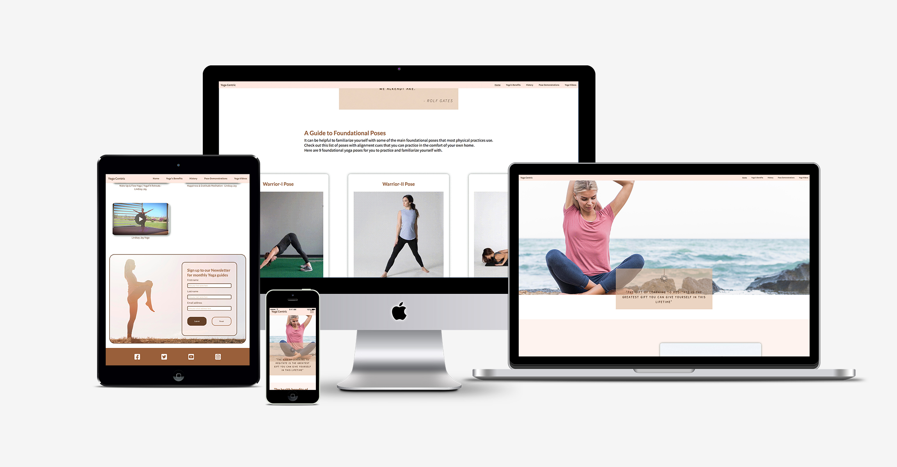
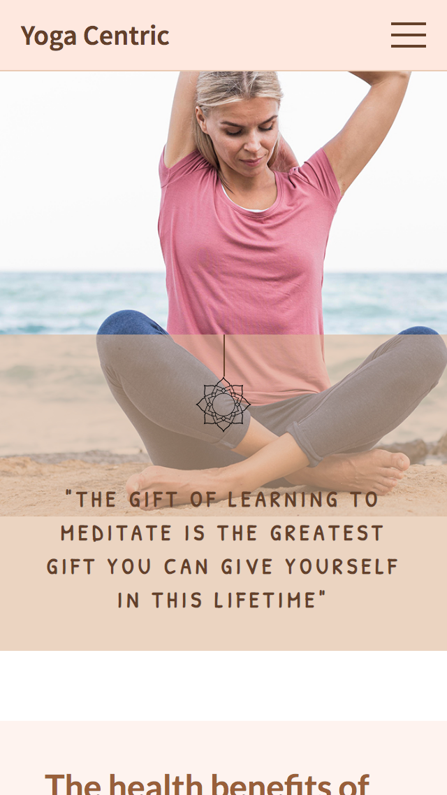
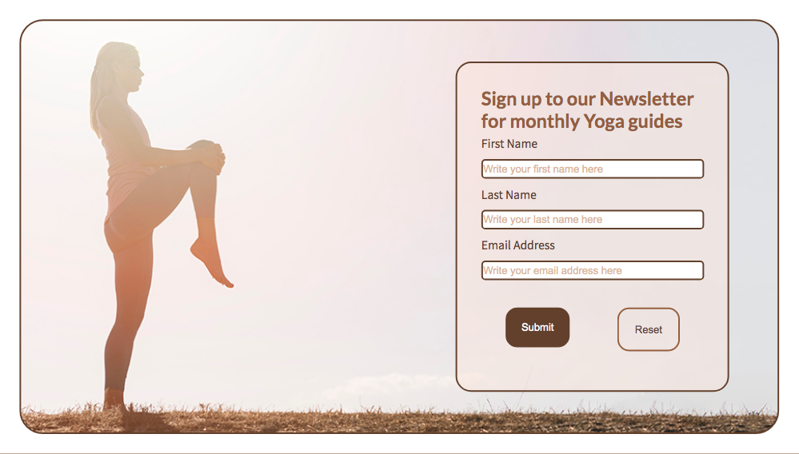

# Yoga Centric!

Welcome, this is an information site about yoga (whodathoughtit).
The goal of the site is to inform the user a little about yoga and to encourage the user to yoga.
There is a brief description of the health benefits of practising yoga.
With a shallow dive into the main era of yoga's history.
The user is encouraged to try some foundation poses with a step by step guide on each of the poses along with an animated gif to help the user visualize the described steps.
The user can watch a small selection of videos with yoga exercise routines and meditation routines.
If the user finds the site useful and informative there is the option to sign up for the monthly newsletter.

Thank you for visiting my project!

&nbsp;

## Features

- __Navigation Bar: Desktop__

  - Featured as a fixed navigation bar at the top of the single page scrolling site. this full responsive navigation bar includes links to the Logo, Home page, Benefits section, History section, Poses and the yoga video sections.
&nbsp;

- __Navigation Bar: Mobile__

  - Featured as a fixed navigation bar at the top of the single page scrolling site. this full responsive navigation bar initially displays a hamburger menu, when pressed this animates to a close icon as the menu is displayed.
  - The links includes links to the Logo, Home page, Benefits section, History section, Poses and the yoga video sections.
  - This section will allow the user to easily navigate from section to section across all devices without having scroll from the top to bottom to find the required section. 
  - When a link is pressed the menu auto closes as the page smoothly scrolls to the required section.
&nbsp;

- __The landing page image__

  - The landing includes a photograph with text overlay with a quotation regarding yoga in it. 
  - This section introduces the user to Yoga Centric and has an unobtrusive, understated animated spinning lotus flower emblem above the quotation.
  - The landing page is fully responsive across screen sizes, keeping the text legible by having the quotation block resize. 
  
&nbsp;

  The landing page is meant to give a calm and welcoming appearance. whilst inviting the user to scroll down to see the partially visible content below.

&nbsp;

- __Health Benefits Section__

  - The health Benefits section will allow the user to read a few of the health benefits of practising Yoga. 
  - This user will see another image of the same woman as the landing page performing a Yoga pose. the consistency in the still images through out the site adds a uniform look within the site. 

  
&nbsp;

- __A Brief History section__

  - This section is to inform the user of a very brief history of the way Yoga has developed of last 5000 years (this is a long time and a lot of history, so I kept this so 4 eras). I added another image to this section, again it is another image of the same woman as the landing page performing a Yoga pose. the consistency in the still images through out the site adds a uniform look within the site.
&nbsp;

  
&nbsp;

- __A Guide to Fundamental Yoga Poses section__

  - This section is to demonstrate to the user 9 fundamental yoga poses, each pose has a set of step by step instructions, these short videos are set to not autoplay but have controls visible and will automatically loop once played, so the user and watch as they read the guide instead of continually pressing play.
  

  
&nbsp;

- __Yoga Exercise Videos section__

  - This section is to let the user watch a small selection of videos with yoga exercise routines and meditation routines.
  - The videos are not set to autoplay as these are longer videos and will only begin downloading as the user begins to play, they are also set at mute.
  - The videos also have a poster image set.

  
&nbsp;

- __Newsletter Sign Up Section__

  - This section will allow the user to sign up to the Yoga Centric Monthly Newsletter. The user will be asked to submit their full name and email address, the form is validated within html5 and after submitting the form is hidden and replaced with a thank you form message. 
&nbsp;

&nbsp;

- __The Footer__ 

  - The footer section includes links to the relevant social media sites for Yoga Centric. The links will open to a new tab to allow easy navigation for the user. 
  - The footer is valuable to the user as it encourages them to keep connected via social media.

&nbsp;

- __Quotation Blocks__ 

  - There are two additional quotation blocks with full width images within the site, these help to separate the sections in to clear section breaks.
  

&nbsp;

### Typeface
In order to find appropriate typefaces for my website, I have visited [Google Fonts](https://fonts.google.com/ "Google Fonts") to explore the various options.
For the main body text I have chosen the google typeface Source Sans Pro. This is a visually appealing and easy to read typeface.
For the headings I wanted a slightly different typeface. I explored for headings on [Fontpair](https://www.fontpair.co/ "Font Pair") and choose the google font Lato.
This font is visually appealing and pairs well with source sans pro.

&nbsp;

### Colours
I based my color scheme on a pallet devised around beach landscapes using the crams of the sand to help create a calm, natural feeling.

* rgba(254, 232, 223, 1) This color is called Champagne Pink - will be used as  a background colour and will be used with a .6 transparency. 
* rgba(222, 183, 152, 1) This color is called Tumbleweed - to be used as a contrast tot the background colour.
* rgba(153, 95, 58, 1) This color is a called Brown Sugar - This is to be used as my header colours.
* rgba(153, 95, 58, 1) This color is a called Van Dyke Brown - This is to be used as my colour to over lay the Champagne Pink.
* The main colour of my text is to be black.

I have used to contract checker on Coolors in order to make sure that the contract is sufficient.
This way my content will be easily readable.

&nbsp;

### Features Left to Implement
- A HTML and CSS only Navigation bar - rather than relying on javascript to close the menu after a click.
- To have the current section show active in the navigation bar.

&nbsp;

## Testing 

- Navigation Bar
  - To test the navigation bar, I have click all the links to ensure they all link to the relevant sections and they all works as expected. 
  - I have also opened the website in various browsers (safari, google chrome, mozilla firefox, Edge) to make sure it works on all browsers and devices.
  - I adjusted the padding on each section to ensure the h1 text at the top of each section was not covered by the navigation bar when the nav links were followed.
  - I checked the nav bar menu changed to the hamburger menu on small devices.
   
&nbsp;

-  Foundation Poses
     - To test the foundation poses, I have played all the videos to ensure play and loop as expected. 
     - I have also opened the website in various browsers (safari, google chrome, mozilla firefox, Edge) to make ensure they play on all browsers and devices.
     - These were initially gifs which I replaced  with the mp4 versions. I added the video controls and stopped the videos from auto playing as this looked too busy when scrolling through.
     - I have opened the site at various sizes to ensure the grid adjusts at the required break points.  
&nbsp;

    
 -  Exercise Videos
    - To test the exercise videos, I have played all the videos to ensure play and loop as expected. 
    - I have also opened the website in various browsers (safari, google chrome, mozilla firefox, Edge) to make ensure they play on all browsers and devices.
    - These were initially added as embedded YouTube iframes. These however gave cookie errors displayed within the developer tools. I choose to replace the iframe with a link to the downloaded video to circumnavigate the cookie issue.
&nbsp;

  
 -  Newsletter Sign up
    - To test the newsletter sign up, I have signed up for the yoga newsletter multiple times ensuring that it works as expected and after sign up displays the thank you for signing up message. 
    - I have also opened the website in various browsers (safari, google chrome, mozilla firefox, Edge) to make ensure the sign up form displays as expected.
&nbsp;

    
-  Footer Social Icons
    - Links - these were checked to ensure they open open in the correct platforms, on mobile testing they opened up the appropriate application. On desktop they opened the correct website.
     - Social Font Awesome Icons - Whilst checking the site across multiple platforms, I noticed a GET fa-brands-400.woff2 error had accured. When cross checking on different browsers the icons also disappeared. I rolled back the site a couple of iterations to check my code and the error continued, after readding the icons to the site the issue remained. The issue was also appearing on other random websites, after this I decide to self host the icons and the error has since stopped.
&nbsp;

### Validator Testing 

- HTML
  - No errors were returned when passing through the official [W3C validator](https://validator.w3.org/nu/?doc=https%3A%2F%2Fdkitley1975.github.io%2Fyoga-centric%2F)
- CSS
  - No errors were found when passing through the official [(Jigsaw) validator](https://jigsaw.w3.org/css-validator/validator?uri=https%3A%2F%2Fdkitley1975.github.io%2Fyoga-centric%2F&profile=css3svg&usermedium=all&warning=1&vextwarning=&lang=en)

&nbsp;

### Unfixed Bugs

No Known bugs at present.

&nbsp;

## Deployment

This project was deployed via GitHub by executing the following steps.
After writing the code, committing and pushing it to GitHub:

1. Navigate to the repository on github and click **Settings**.
1. From there, go to the **Source section** within the Github Pages section.
1. Select **master branch** on the dropdown menu, and click save.
2. Now the website is live on **https://dkitley1975.github.io/yoga-centric/** 
3. Any time commits and pushes are sent to Github, the Github Pages site should update shortly after.

To run the project locally:

1. Click the **green Clone or Download button** on the Github Repository
1. Using the **Clone with HTTPS option**, copy the link displayed.
1. Open your IDE, and ensure the Git Terminal is open.
1. Change the working directory to the location where the cloned directory is to go.
1. Use the **"git clone" command** and paste the url copied in the second step.

The live link can be found here - **https://dkitley1975.github.io/yoga-centric/** 

&nbsp;

## Credits 

### Content 

- The Newsletter sign up section uses Email.js to implement the sending of the emails - Instead of having the javascript run totally within the html, I created a new .js file and placed the code in there. referencing this external file. I added additional code to this to add a 'display = "none"' to the original Newsletter Sign-up form and display = "block" to the Thank you form.
- I wanted to incorporate on the mobile Navigation menu the ability to have it automatically close after selecting a link. I found demonstration which did what I wanted here: https://dev.to/devggaurav/let-s-build-a-responsive-navbar-and-hamburger-menu-using-html-css-and-javascript-4gci. Adapting and incorporating this into my navigation worked.
- The instructions for the Yoga poses was taken from:
https://www.healthline.com/health/fitness-exercises/definitive-guide-to-yoga#-the-basics-and-foundation
Rather than attempt to rewrite these instructions It was better to use the verbatim, as trying to rewrite them would still cause an issue with plagiarism checkers and most likely would cause some one a injury from following unsafe instructions.

&nbsp;

### Media
- The icons in the footer were taken from [Font Awesome](https://fontawesome.com/)
- The photos used on the throughout the site were all from www.freepik.com
- The animated gifs used for the Foundation Poses were taken from gfycat.com
- Videos (*These were initially added as embedded YouTube iframes. This however gave cookie errors displayed within the developer tools. I choose to replace the iframe with a link to the downloaded video to circumnavigate the cookie issue, and just incase the Youtube video was removed this would result in a broken link within this project.*)
  - The Wake Up & Flow Yoga | YogaFit Retreats - Lindsay Jay video is from:  https://youtu.be/bTs73IH7Ycw
  - Happiness & Gratitude Meditation - Lindsay Jay video is from: https://youtu.be/nSISnimEq30
  - Lindsay Jay Yoga video is from: https://youtu.be/KarBeaitMNs

